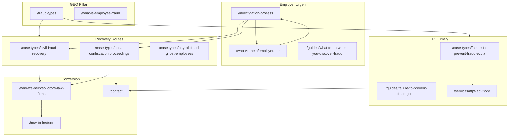
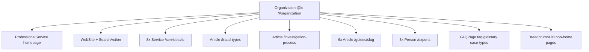

# SEO Architecture — employeefraudexpert.com

**Site:** https://www.employeefraudexpert.com  
**Audience:** UK solicitors and law firms (civil fraud recovery, criminal proceedings, POCA, regulatory matters) **and** UK employers, HR directors, and finance teams who have discovered suspected employee fraud  
**Primary KPI:** Rank for Tier 1 transactional terms (e.g. *employee fraud expert witness UK*, *employee fraud forensic accountant UK*, *payroll fraud expert witness UK*)  
**Last updated:** May 2026

This document is the canonical SEO blueprint for EmployeeFraudExpert.com. It governs keyword targeting, content clusters, internal linking, structured data, GEO (generative engine optimization), off-page activity, competitor monitoring, FTPF timeliness, dual-audience conversion, and deployment.

**Unique differentiator:** The UK **Failure to Prevent Fraud** offence under the Economic Crime and Corporate Transparency Act 2023 came into force **1 September 2025**. FTPF content is the highest-priority SEO work after the homepage. See [Section 8](#8-strategic-note--timeliness).

---

## Table of contents

1. [Keyword strategy](#1-keyword-strategy)
2. [Content cluster map](#2-content-cluster-map)
3. [Internal linking rules](#3-internal-linking-rules)
4. [Schema architecture](#4-schema-architecture)
5. [GEO optimization targets](#5-geo-optimization-targets)
6. [Off-page SEO targets](#6-off-page-seo-targets)
7. [Competitor monitoring](#7-competitor-monitoring)
8. [Strategic note — timeliness](#8-strategic-note--timeliness)
9. [Deployment checklist](#9-deployment-checklist)
- [Sitemap & robots generation](#sitemap--robots-generation)
- [Appendix A: Full route inventory](#appendix-a-full-route-inventory)
- [Appendix B: Sitemap priorities](#appendix-b-sitemap-priorities)
- [Appendix C: Title and meta templates](#appendix-c-title-and-meta-templates)
- [Appendix D: Implementation status](#appendix-d-implementation-status)

---

## 1. Keyword strategy

### Tier 1 — Transactional

| Keyword |
|---------|
| employee fraud expert witness |
| employee fraud expert witness UK |
| employee fraud forensic accountant UK |
| workplace fraud expert witness |
| embezzlement expert witness UK |
| payroll fraud expert witness UK |
| fraud investigation expert UK |
| employee theft expert witness |
| forensic accountant employee fraud UK |
| staff fraud expert witness UK |

### Tier 2 — Informational

| Keyword |
|---------|
| what to do when employee steals |
| how to investigate employee fraud UK |
| employee fraud investigation process UK |
| failure to prevent fraud offence ECCTA |
| what is the FTPF offence 2025 |
| civil vs criminal employee fraud UK |
| POCA confiscation employee fraud |
| legal professional privilege fraud investigation |
| how to recover money from employee fraud UK |
| employee fraud prevention ECCTA 2023 |

### Tier 3 — Long-tail / urgent

| Keyword |
|---------|
| discovered employee fraud what to do UK |
| ghost employee payroll fraud expert witness |
| invoice fraud forensic accountant UK |
| expense fraud investigation expert UK |
| director fraud expert witness UK |
| failure to prevent fraud expert advisory UK |
| civil fraud recovery expert witness UK |
| POCA confiscation forensic accountant UK |
| employee embezzlement expert witness |
| bribery corruption expert witness UK employer |

### Keyword → URL mapping

| Keyword cluster | Primary URL | Secondary URLs |
|-----------------|-------------|----------------|
| employee fraud expert witness | `/` | `/qualifications`, `/how-to-instruct`, `/experts` |
| employee fraud expert witness UK | `/` | `/who-we-help/solicitors-law-firms`, `/services` |
| employee fraud forensic accountant UK | `/services#fraud-investigation` | `/qualifications`, `/fraud-types` |
| workplace fraud expert witness | `/fraud-types` | `/`, `/what-is-employee-fraud` |
| embezzlement expert witness UK | `/case-types/civil-fraud-recovery` | `/fraud-types`, `/services#loss-quantification` |
| payroll fraud expert witness UK | `/case-types/payroll-fraud-ghost-employees` | `/guides/payroll-fraud-detection-guide`, `/services#payroll-fraud-analysis` |
| fraud investigation expert UK | `/services#fraud-investigation` | `/investigation-process`, `/how-to-instruct` |
| employee theft expert witness | `/case-types/civil-fraud-recovery` | `/fraud-types`, `/guides/what-to-do-when-you-discover-fraud` |
| forensic accountant employee fraud UK | `/` | `/services`, `/qualifications` |
| staff fraud expert witness UK | `/` | `/who-we-help/employers-hr`, `/faq` |
| what to do when employee steals | `/investigation-process` | `/guides/what-to-do-when-you-discover-fraud`, `/who-we-help/employers-hr` |
| how to investigate employee fraud UK | `/investigation-process` | `/services#fraud-investigation`, `/faq` |
| employee fraud investigation process UK | `/investigation-process` | `/guides/what-to-do-when-you-discover-fraud`, `/contact` |
| failure to prevent fraud offence ECCTA | `/case-types/failure-to-prevent-fraud-eccta` | `/guides/failure-to-prevent-fraud-guide`, `/glossary#failure-to-prevent-fraud-ftpf-offence` |
| what is the FTPF offence 2025 | `/case-types/failure-to-prevent-fraud-eccta` | `/glossary#failure-to-prevent-fraud-ftpf-offence`, `/glossary#economic-crime-and-corporate-transparency-act-2023-eccta` |
| civil vs criminal employee fraud UK | `/investigation-process` | `/case-types/civil-fraud-recovery`, `/faq` |
| POCA confiscation employee fraud | `/case-types/poca-confiscation-proceedings` | `/guides/poca-confiscation-fraud-guide`, `/glossary#poca-2002-proceeds-of-crime-act` |
| legal professional privilege fraud investigation | `/who-we-help/employers-hr` | `/glossary#legal-professional-privilege-lpp`, `/investigation-process` |
| how to recover money from employee fraud UK | `/case-types/civil-fraud-recovery` | `/guides/civil-fraud-recovery-guide`, `/services#asset-tracing` |
| employee fraud prevention ECCTA 2023 | `/guides/employee-fraud-prevention-controls` | `/case-types/failure-to-prevent-fraud-eccta`, `/services#ftpf-advisory` |
| discovered employee fraud what to do UK | `/investigation-process` | `/guides/what-to-do-when-you-discover-fraud`, `/who-we-help/employers-hr` |
| ghost employee payroll fraud expert witness | `/case-types/payroll-fraud-ghost-employees` | `/guides/payroll-fraud-detection-guide`, `/glossary#ghost-employee` |
| invoice fraud forensic accountant UK | `/case-types/invoice-supplier-fraud` | `/services#invoice-supplier-investigation`, `/fraud-types` |
| expense fraud investigation expert UK | `/case-types/expense-fraud-investigation` | `/services#expense-procurement-review`, `/fraud-types` |
| director fraud expert witness UK | `/case-types/director-misconduct-misappropriation` | `/case-types/civil-fraud-recovery`, `/services#expert-witness-reports` |
| failure to prevent fraud expert advisory UK | `/services#ftpf-advisory` | `/case-types/failure-to-prevent-fraud-eccta`, `/guides/failure-to-prevent-fraud-guide` |
| civil fraud recovery expert witness UK | `/case-types/civil-fraud-recovery` | `/guides/civil-fraud-recovery-guide`, `/who-we-help/solicitors-law-firms` |
| POCA confiscation forensic accountant UK | `/case-types/poca-confiscation-proceedings` | `/guides/poca-confiscation-fraud-guide`, `/glossary#benefit-from-criminal-conduct-poca` |
| employee embezzlement expert witness | `/case-types/civil-fraud-recovery` | `/fraud-types`, `/what-is-employee-fraud` |
| bribery corruption expert witness UK employer | `/case-types/bribery-corruption` | `/glossary#bribery-act-2010`, `/who-we-help/solicitors-law-firms` |

---

## 2. Content cluster map

Eight topical hubs anchor the site. The GEO pillar `/fraud-types` and the employer-urgent pillar `/investigation-process` sit at the centre of discovery and conversion clusters. FTPF (Hub 3) is the highest-priority timely cluster after the homepage.

### URL canonicalization policy

All internal links, sitemap entries, schema `@id` values, and JSON-LD must use **canonical slugs** below. Shorthand paths from early SEO briefs are **aliases only** — do not create duplicate routes. Implement **301 redirects** in `middleware.ts` or `next.config.ts` if shorthand URLs are ever published externally.

| Alias (do not use as route) | Canonical path |
|-----------------------------|----------------|
| `/case-types/failure-to-prevent-fraud` | `/case-types/failure-to-prevent-fraud-eccta` |
| `/case-types/poca-confiscation` | `/case-types/poca-confiscation-proceedings` |
| `/case-types/payroll-fraud` | `/case-types/payroll-fraud-ghost-employees` |
| `/case-types/invoice-fraud` | `/case-types/invoice-supplier-fraud` |
| `/case-types/expense-fraud` | `/case-types/expense-fraud-investigation` |
| `/case-types/director-fraud` | `/case-types/director-misconduct-misappropriation` |
| `/guides/failure-to-prevent-fraud` | `/guides/failure-to-prevent-fraud-guide` |
| `/guides/payroll-fraud-detection` | `/guides/payroll-fraud-detection-guide` |
| `/guides/poca-confiscation-fraud` | `/guides/poca-confiscation-fraud-guide` |
| `/guides/employee-fraud-prevention` | `/guides/employee-fraud-prevention-controls` |
| `/guides/civil-fraud-recovery` (without `-guide`) | `/guides/civil-fraud-recovery-guide` |
| `/who-we-help/solicitors` | `/who-we-help/solicitors-law-firms` |
| `/glossary#lpp` | `/glossary#legal-professional-privilege-lpp` |
| `/glossary#ftpf` | `/glossary#failure-to-prevent-fraud-ftpf-offence` |
| `/glossary#eccta` | `/glossary#economic-crime-and-corporate-transparency-act-2023-eccta` |
| `/glossary#poca` | `/glossary#poca-2002-proceeds-of-crime-act` |
| `/glossary#freezing-injunction` | `/glossary#freezing-injunction-mareva` |
| `/glossary#norwich-pharmacal` | `/glossary#norwich-pharmacal-order` |
| `/glossary#benefit-criminal-conduct` | `/glossary#benefit-from-criminal-conduct-poca` |
| `/glossary#tainted-gift` | `/glossary#tainted-gift-poca` |
| `/glossary#legal-professional-privilege` | `/glossary#legal-professional-privilege-lpp` |

Glossary anchors are generated by `glossaryAnchorId(term)` in `src/lib/glossary-slug.ts` (same algorithm as the dispute-network sites).

### Hub overview

| Hub | Pillar / anchor | Primary intent |
|-----|-----------------|----------------|
| 1 | What to Do When Fraud is Discovered | Employer-urgent discovery, first 72 hours |
| 2 | Fraud Types (Master) | ACFE taxonomy, red flags, case-type routing |
| 3 | FTPF / ECCTA 2023 | Timely regulatory offence, advisory, compliance |
| 4 | Civil Fraud Recovery | Asset tracing, freezing orders, Norwich Pharmacal |
| 5 | POCA Confiscation | Criminal proceeds, benefit from conduct, tainted gifts |
| 6 | Payroll Fraud | Ghost employees, payroll analysis methodology |
| 7 | Solicitor Expert Witness | CPR Part 35 instruction, qualifications, fees |
| 8 | Fraud Prevention & FTPF | Controls, fraud triangle, employer compliance |

### Hub 1: What to Do When Fraud is Discovered (Employer Urgent)

**Supporting pages:**

- `/investigation-process` (pillar)
- `/who-we-help/employers-hr`
- `/guides/what-to-do-when-you-discover-fraud`
- `/case-types/civil-fraud-recovery`
- `/glossary#legal-professional-privilege-lpp`
- `/glossary#freezing-injunction-mareva`
- `/faq` (call police or accountant Q&A)

### Hub 2: Fraud Types (Master)

**Supporting pages:**

- `/fraud-types` (pillar)
- All `/case-types/[slug]` (×10)
- `/what-is-employee-fraud`
- `/glossary` (all fraud-type terms)
- `/faq` (fraud type Q&As)

### Hub 3: FTPF / ECCTA 2023 (Timely Legal Development)

**Supporting pages:**

- `/case-types/failure-to-prevent-fraud-eccta`
- `/guides/failure-to-prevent-fraud-guide`
- `/what-is-employee-fraud` (FTPF section)
- `/fraud-types` (FTPF section)
- `/services#ftpf-advisory`
- `/glossary#failure-to-prevent-fraud-ftpf-offence`
- `/glossary#economic-crime-and-corporate-transparency-act-2023-eccta`

### Hub 4: Civil Fraud Recovery

**Supporting pages:**

- `/case-types/civil-fraud-recovery`
- `/guides/civil-fraud-recovery-guide`
- `/who-we-help/solicitors-law-firms`
- `/services#asset-tracing`
- `/glossary#norwich-pharmacal-order`
- `/glossary#freezing-injunction-mareva`
- `/glossary#asset-tracing`

### Hub 5: POCA Confiscation

**Supporting pages:**

- `/case-types/poca-confiscation-proceedings`
- `/guides/poca-confiscation-fraud-guide`
- `/glossary#poca-2002-proceeds-of-crime-act`
- `/glossary#benefit-from-criminal-conduct-poca`
- `/glossary#tainted-gift-poca`
- `/who-we-help/solicitors-law-firms`

### Hub 6: Payroll Fraud

**Supporting pages:**

- `/case-types/payroll-fraud-ghost-employees`
- `/guides/payroll-fraud-detection-guide`
- `/services#payroll-fraud-analysis`
- `/fraud-types` (payroll section)
- `/glossary#ghost-employee`
- `/glossary#payroll-fraud`

### Hub 7: Solicitor Expert Witness

**Supporting pages:**

- `/who-we-help/solicitors-law-firms`
- `/how-to-instruct`
- `/qualifications`
- `/fees`
- `/case-types` (hub — all 10)
- `/glossary#cpr-part-35`

### Hub 8: Fraud Prevention & FTPF

**Supporting pages:**

- `/guides/employee-fraud-prevention-controls`
- `/case-types/failure-to-prevent-fraud-eccta`
- `/services#ftpf-advisory`
- `/who-we-help/employers-hr`
- `/glossary#fraud-triangle-acfe`
- `/glossary#failure-to-prevent-fraud-ftpf-offence`

### Content cluster diagram



### Slug inventories

#### Case types (10)

| Slug | H1 focus |
|------|----------|
| `civil-fraud-recovery` | Civil Fraud Recovery Expert Witness UK |
| `poca-confiscation-proceedings` | POCA Confiscation Proceedings Expert Witness UK |
| `employment-tribunal-fraud` | Employment Tribunal Fraud Expert Witness UK |
| `director-misconduct-misappropriation` | Director Misconduct & Misappropriation Expert Witness UK |
| `payroll-fraud-ghost-employees` | Payroll Fraud & Ghost Employees Expert Witness UK |
| `invoice-supplier-fraud` | Invoice & Supplier Fraud Expert Witness UK |
| `expense-fraud-investigation` | Expense Fraud Investigation Expert Witness UK |
| `data-ip-theft` | Data & IP Theft Expert Witness UK |
| `bribery-corruption` | Bribery & Corruption Expert Witness UK |
| `failure-to-prevent-fraud-eccta` | Failure to Prevent Fraud (ECCTA) Expert Witness UK |

*Source: `src/data/case-types.ts`*

#### Guides (6)

| Slug | H1 focus | `aboutServiceId` (Article schema) |
|------|----------|-----------------------------------|
| `what-to-do-when-you-discover-fraud` | What to Do When You Discover Employee Fraud | `fraud-investigation` |
| `civil-fraud-recovery-guide` | Civil Fraud Recovery: A Solicitor's Guide | `asset-tracing` |
| `failure-to-prevent-fraud-guide` | Failure to Prevent Fraud: What Employers Must Know | `ftpf-advisory` |
| `payroll-fraud-detection-guide` | Payroll Fraud Detection: Forensic Methodology | `payroll-fraud-analysis` |
| `poca-confiscation-fraud-guide` | POCA Confiscation in Employee Fraud Cases | `asset-tracing` |
| `employee-fraud-prevention-controls` | Employee Fraud Prevention: Controls & FTPF Readiness | `ftpf-advisory` |

*Source: `src/data/guides.ts`*

#### Services (8 anchors on `/services`)

| Anchor ID | Label |
|-----------|-------|
| `fraud-investigation` | Employee Fraud Investigation |
| `asset-tracing` | Asset Tracing & Recovery Support |
| `loss-quantification` | Loss Quantification |
| `payroll-fraud-analysis` | Payroll Fraud Analysis |
| `expense-procurement-review` | Expense & Procurement Fraud Review |
| `invoice-supplier-investigation` | Invoice & Supplier Fraud Investigation |
| `expert-witness-reports` | Expert Witness Reports (CPR Part 35) |
| `ftpf-advisory` | Failure to Prevent Fraud Advisory |

*Source: `src/data/services.ts`, `src/lib/schema.ts` (`serviceNode` IDs)*

#### Glossary (32 terms, definition-first)

Anchor slugs generated by `glossaryAnchorId()` in `src/lib/glossary-slug.ts`.

| # | Term | Anchor slug |
|---|------|-------------|
| 1 | Asset Misappropriation | `#asset-misappropriation` |
| 2 | Asset Tracing | `#asset-tracing` |
| 3 | Bribery Act 2010 | `#bribery-act-2010` |
| 4 | Benefit from Criminal Conduct (POCA) | `#benefit-from-criminal-conduct-poca` |
| 5 | CPR Part 35 | `#cpr-part-35` |
| 6 | Deferred Prosecution Agreement (DPA) | `#deferred-prosecution-agreement-dpa` |
| 7 | Economic Crime and Corporate Transparency Act 2023 (ECCTA) | `#economic-crime-and-corporate-transparency-act-2023-eccta` |
| 8 | Embezzlement | `#embezzlement` |
| 9 | Expense Fraud | `#expense-fraud` |
| 10 | Failure to Prevent Fraud (FTPF) Offence | `#failure-to-prevent-fraud-ftpf-offence` |
| 11 | False Accounting (Theft Act 1968 s17) | `#false-accounting-theft-act-1968-s17` |
| 12 | Fraud Act 2006 | `#fraud-act-2006` |
| 13 | Fraud by Abuse of Position (s4 Fraud Act 2006) | `#fraud-by-abuse-of-position-s4-fraud-act-2006` |
| 14 | Fraud Triangle (ACFE) | `#fraud-triangle-acfe` |
| 15 | Freezing Injunction (Mareva) | `#freezing-injunction-mareva` |
| 16 | Ghost Employee | `#ghost-employee` |
| 17 | The Ikarian Reefer Duties | `#the-ikarian-reefer-duties` |
| 18 | Invoice Fraud | `#invoice-fraud` |
| 19 | Kickback | `#kickback` |
| 20 | Legal Professional Privilege (LPP) | `#legal-professional-privilege-lpp` |
| 21 | Loss Quantification | `#loss-quantification` |
| 22 | Misfeasance (IA 1986 s212) | `#misfeasance-ia-1986-s212` |
| 23 | Norwich Pharmacal Order | `#norwich-pharmacal-order` |
| 24 | Occupational Fraud | `#occupational-fraud` |
| 25 | Payroll Fraud | `#payroll-fraud` |
| 26 | POCA 2002 (Proceeds of Crime Act) | `#poca-2002-proceeds-of-crime-act` |
| 27 | Procurement Fraud | `#procurement-fraud` |
| 28 | Search Order (Anton Piller) | `#search-order-anton-piller` |
| 29 | Serious Fraud Office (SFO) | `#serious-fraud-office-sfo` |
| 30 | Single Joint Expert (SJE) | `#single-joint-expert-sje` |
| 31 | Tainted Gift (POCA) | `#tainted-gift-poca` |
| 32 | Theft Act 1968 | `#theft-act-1968` |

*Source: `src/data/glossary.ts`*

#### Glossary term → page cross-links (content)

| Term anchor | Links to |
|-------------|----------|
| `#failure-to-prevent-fraud-ftpf-offence` | `/case-types/failure-to-prevent-fraud-eccta` |
| `#poca-2002-proceeds-of-crime-act` | `/case-types/poca-confiscation-proceedings` |
| `#fraud-act-2006` | `/what-is-employee-fraud` |
| `#ghost-employee` | `/case-types/payroll-fraud-ghost-employees` |
| `#invoice-fraud` | `/case-types/invoice-supplier-fraud` |
| `#kickback` | `/case-types/invoice-supplier-fraud` |
| `#freezing-injunction-mareva` | `/case-types/civil-fraud-recovery` |
| `#norwich-pharmacal-order` | `/case-types/civil-fraud-recovery` |
| `#cpr-part-35` | `/qualifications` |
| `#legal-professional-privilege-lpp` | `/who-we-help/employers-hr` |
| `#fraud-triangle-acfe` | `/fraud-types` |
| `#asset-tracing` | `/services#asset-tracing` |

---

## 3. Internal linking rules

These rules govern all on-page links, `relatedLinks` in data files, nav/footer IA, and merge helpers in `src/lib/seo-internal-links.ts`. Every link must use **canonical paths** from [Section 2](#url-canonicalization-policy).

### Rule 1 — `/investigation-process` links to:

- `/who-we-help/employers-hr`
- `/case-types/civil-fraud-recovery`
- `/case-types/poca-confiscation-proceedings`
- `/how-to-instruct`
- `/glossary#legal-professional-privilege-lpp`
- `/glossary#freezing-injunction-mareva`
- `/contact`

### Rule 2 — `/fraud-types` links to:

- All 10 `/case-types/[slug]` pages
- `/what-is-employee-fraud`
- All relevant `/glossary` terms (fraud-type definitions)
- `/services` (hub + section anchors where cited)
- `/contact`

### Rule 3 — `/who-we-help/employers-hr` links to:

- `/investigation-process`
- `/fraud-types`
- Relevant `/case-types/[slug]` (civil recovery, payroll, expense, invoice as applicable)
- `/how-to-instruct`
- `/faq`
- `/contact`

### Rule 4 — `/who-we-help/solicitors-law-firms` links to:

- `/how-to-instruct`
- `/qualifications`
- All 10 `/case-types/[slug]` pages (via hub or direct list)
- `/fees`
- `/contact`

### Rule 5 — Every `/case-types/[slug]` links to:

- Relevant `/services` section (anchor ID from case-type data)
- Relevant `/guides/[slug]` (paired guide where exists)
- `/fraud-types` (relevant section anchor)
- `/glossary` (key terms for that case type)
- `/who-we-help` (relevant audience page: employers vs solicitors)
- `/contact`

**Case-type → guide pairing:**

| Case type slug | Guide slug |
|----------------|------------|
| `civil-fraud-recovery` | `civil-fraud-recovery-guide` |
| `poca-confiscation-proceedings` | `poca-confiscation-fraud-guide` |
| `payroll-fraud-ghost-employees` | `payroll-fraud-detection-guide` |
| `failure-to-prevent-fraud-eccta` | `failure-to-prevent-fraud-guide` |
| (discovery / general) | `what-to-do-when-you-discover-fraud` |

### Rule 6 — Every `/guides/[slug]` links to:

- `/guides` hub
- Relevant `/case-types/[slug]`
- `/fraud-types`
- `/investigation-process` (where relevant — especially discovery guide)
- `/who-we-help` (employers-hr or solicitors-law-firms as appropriate)
- `/contact`

### Rule 7 — Homepage links to:

- `/who-we-help/employers-hr`
- `/who-we-help/solicitors-law-firms`
- All 8 `/services` section anchors
- `/fraud-types`
- `/investigation-process`
- `/what-is-employee-fraud`
- `/guides`
- `/faq`
- `/contact`

### Rule 8 — `/glossary` terms link to:

Per the [glossary cross-link table](#glossary-32-terms-definition-first) in Section 2. Each term's `href` in `src/data/glossary.ts` must point to the most relevant discipline, case-type, guide, service anchor, or audience page. All glossary pages also link to `/fraud-types` for occupational-fraud taxonomy terms.

### Internal linking implementation map

| Component / file | Role |
|------------------|------|
| `src/lib/seo-internal-links.ts` | `HOMEPAGE_SEO_LINKS`, `mergeCaseTypeLinks`, `mergeGuideLinks`, `mergeEmployersLinks`, `mergeSolicitorsLinks` |
| `src/data/nav.ts` | Global nav, mobile groups, footer columns |
| `src/data/*/relatedLinks` | Per-page related link sets |
| `src/components/RelatedLinks.tsx` | Renders related link grid at page bottom |
| `src/components/ContentPageTemplate.tsx` | Breadcrumb + FAQPage JSON-LD + related links |
| `src/components/GuidePageTemplate.tsx` | Article schema + related links |
| `src/components/CTASection.tsx` | Hard-coded `/contact` CTA |
| `middleware.ts` | Apex → www; optional alias → canonical 301s |

**Clone pattern from:** `dispute-forensic/src/lib/seo-internal-links.ts`

### Legacy URL redirects (if aliases were published)

| From (alias) | To (canonical) |
|--------------|----------------|
| `/case-types/failure-to-prevent-fraud` | `/case-types/failure-to-prevent-fraud-eccta` |
| `/case-types/poca-confiscation` | `/case-types/poca-confiscation-proceedings` |
| `/case-types/payroll-fraud` | `/case-types/payroll-fraud-ghost-employees` |
| `/who-we-help/solicitors` | `/who-we-help/solicitors-law-firms` |
| `/guides/failure-to-prevent-fraud` | `/guides/failure-to-prevent-fraud-guide` |

---

## 4. Schema architecture

### Root graph

Root entity: **Organization**  
`@id`: `https://www.employeefraudexpert.com/#organization`



### Children of Organization

| Schema type | Page(s) | Builder |
|-------------|---------|---------|
| Organization | Root `@graph` | `organizationSchema` in `src/lib/schema.ts` |
| ProfessionalService | Homepage | `professionalServiceSchema()` — `serviceType`: "Employee Fraud Expert Witness" |
| WebSite + SearchAction | Homepage | `websiteSchema` — `target`: `/glossary?q={search_term_string}` |
| Service (×8) | `/services#…` | `serviceNode()` — IDs in [Services table](#services-8-anchors-on-services) |
| Article | `/fraud-types` (pillar) | `articleSchema()` — `about` → `#fraud-investigation` |
| Article | `/investigation-process` | `articleSchema()` — `about` → `#fraud-investigation` |
| Article (×6) | `/guides/[slug]` | `articleSchema()` with `aboutServiceId` per guide |
| Person (×3) | `/experts` | `personSchema()` |
| FAQPage | `/faq`, `/glossary`, `/case-types/[slug]` (×10) | `faqPageSchema()` |
| BreadcrumbList | All non-homepage pages | `breadcrumbSchema()` |

### Per-page schema assignment

| Page type | Schema types | Source |
|-----------|-------------|--------|
| Homepage | Organization, ProfessionalService, WebSite + SearchAction, 8× Service | `layout.tsx` + `page.tsx` `@graph` |
| `/fraud-types` | Article + BreadcrumbList | `articleSchema()` |
| `/investigation-process` | Article + BreadcrumbList | `articleSchema()` |
| `/guides/[slug]` | Article + BreadcrumbList | `GuidePageTemplate.tsx` |
| `/case-types/[slug]` | FAQPage + BreadcrumbList | `ContentPageTemplate.tsx` |
| `/who-we-help/employers-hr`, `/who-we-help/solicitors-law-firms` | Organization (reference) + BreadcrumbList | Page component |
| `/services` | 8× Service nodes in page or `@graph` | `serviceNode()` |
| `/experts` | 3× Person | `personSchema()` |
| `/glossary`, `/faq` | FAQPage | `faqPageSchema()` |

### Homepage `@graph` example

Inject via `JsonLd` component (`src/components/JsonLd.tsx`):

```json
{
  "@context": "https://schema.org",
  "@graph": [
    {
      "@type": "Organization",
      "@id": "https://www.employeefraudexpert.com/#organization",
      "name": "EmployeeFraudExpert",
      "url": "https://www.employeefraudexpert.com",
      "email": "contact@employeefraudexpert.com",
      "address": { "@type": "PostalAddress", "addressCountry": "GB" },
      "areaServed": "United Kingdom"
    },
    {
      "@type": "ProfessionalService",
      "@id": "https://www.employeefraudexpert.com/#service",
      "provider": { "@id": "https://www.employeefraudexpert.com/#organization" },
      "serviceType": "Employee Fraud Expert Witness"
    },
    {
      "@type": "WebSite",
      "@id": "https://www.employeefraudexpert.com/#website",
      "publisher": { "@id": "https://www.employeefraudexpert.com/#organization" },
      "potentialAction": {
        "@type": "SearchAction",
        "target": "https://www.employeefraudexpert.com/glossary?q={search_term_string}",
        "query-input": "required name=search_term_string"
      }
    }
  ]
}
```

**Clone pattern from:** `dispute-forensic/src/lib/schema.ts`, `dispute-forensic/src/components/JsonLd.tsx`

---

## 5. GEO optimization targets

AI citation content — structured, definition-first, table-heavy pages designed for retrieval by generative search engines.

| # | Target | URL | Content format | Primary keywords |
|---|--------|-----|----------------|----------------|
| 1 | Employee fraud types master table (ACFE categories) | `/fraud-types` | Comparison table: type, description, typical loss, red flags | types of employee fraud UK |
| 2 | ACFE fraud red flags table | `/fraud-types` | Red-flag matrix by fraud type | employee fraud red flags |
| 3 | Civil vs criminal route comparison | `/investigation-process` | Side-by-side table: route, threshold, timeline, recovery | civil vs criminal employee fraud UK |
| 4 | 72-hour investigation step guide | `/investigation-process` | Numbered steps: hours 0–24, 24–48, 48–72 | employee fraud investigation process UK |
| 5 | FTPF offence explanation | `/case-types/failure-to-prevent-fraud-eccta` | Definition, scope, defences, penalties, who is in scope | failure to prevent fraud offence ECCTA |
| 6 | Ghost employee detection methodology | `/case-types/payroll-fraud-ghost-employees` | Forensic steps, data sources, sample tests | ghost employee payroll fraud expert witness |
| 7 | Invoice fraud investigation methodology | `/services#invoice-supplier-investigation` | Phase-by-phase investigation workflow | invoice fraud forensic accountant UK |
| 8 | UK fraud statistics table | `/` (homepage) | Cited statistics with source footnotes | employee fraud UK statistics |
| 9 | Glossary (32 terms) | `/glossary` | Definition-first, one paragraph per term | POCA, FTPF, LPP, CPR Part 35 |
| 10 | LPP explained for employers | `/who-we-help/employers-hr` | Plain-English LPP section + when to instruct counsel | legal professional privilege fraud investigation |

### Unique GEO assets

1. **72-hour investigation guide** — `/investigation-process` is unique to this site; targets urgent employer discovery queries.
2. **FTPF first-mover content** — offence in force September 2025; competitors are still publishing; maintain freshness through 2025–2026.
3. **Dual-audience conversion** — employer vs solicitor paths on homepage and contact form reinforce topical authority for both segments.

### H2 anchor text guidance (GEO)

| Page | Recommended H2s |
|------|-----------------|
| `/fraud-types` | "Types of Employee Fraud in the UK"; "ACFE Occupational Fraud Categories"; "Red Flags by Fraud Type" |
| `/investigation-process` | "What to Do in the First 72 Hours"; "Civil vs Criminal: Which Route?"; "Should You Call the Police or a Forensic Accountant?" |
| `/case-types/failure-to-prevent-fraud-eccta` | "What Is the Failure to Prevent Fraud Offence?"; "Who Does FTPF Apply To?"; "Reasonable Procedures Defence" |

---

## 6. Off-page SEO targets

### Directories

| Directory | URL | Priority |
|-----------|-----|----------|
| UK Register of Expert Witnesses | [jspubs.com](https://www.jspubs.com) | Primary — fraud / forensic accounting filter |
| Academy of Experts | academyofexperts.org | Credential-aligned listing |
| Expert Witness Institute (EWI) | ewi.org.uk | Core expert witness directory |
| ACFE UK Chapter directory | acfe.com | Fraud / CFE credential |
| ICAEW Forensic accreditation | icaew.com | Forensic accounting discipline |
| Fraud Advisory Panel | fraudadvisorypanel.org | Practitioner network |

### Publications (guest articles, citations, commentary)

| Publication | Relevance |
|-------------|-----------|
| Fraud Intelligence | Fraud investigation, civil recovery |
| ACFE Fraud Magazine | Occupational fraud, ACFE methodology |
| Accountancy Age | Forensic accounting, employer finance audience |
| Computer Weekly | Data / IP theft, digital evidence angle |
| HR Magazine | Employer-direct discovery audience |
| Personnel Today | HR / employment fraud response |
| Employment Law Journal | Tribunal, dismissal, investigation process |

### Digital PR angles

| Angle | Target keywords / audience |
|-------|---------------------------|
| "Failure to Prevent Fraud: Is Your Organisation Ready? ECCTA 2023 in Force September 2025" | FTPF, ECCTA, compliance officers |
| "Ghost Employees Cost UK Employers £X Billion in 2024" | payroll fraud, ghost employee |
| "Employee Fraud Discovery: Why You Should Call a Forensic Accountant Before the Police" | discovered employee fraud what to do UK |
| "Invoice Fraud: The UK's Most Common Employee Fraud Type in 2025" | invoice fraud forensic accountant UK |
| "POCA Confiscation vs Civil Recovery: Which Gets Employers More Money Back?" | POCA confiscation, civil fraud recovery |

---

## 7. Competitor monitoring

### Monthly review targets

| Competitor | URL | What to track |
|------------|-----|---------------|
| Pinsent Masons | [pinsentmasons.com/out-law/guides/using-the-civil-courts-to-recover-assets-after-employee-fraud](https://www.pinsentmasons.com/out-law/guides/using-the-civil-courts-to-recover-assets-after-employee-fraud) | Civil recovery content updates |
| Grant Thornton | [grantthornton.co.uk/services/forensic-and-investigation-services/fraud-investigation](https://www.grantthornton.co.uk/services/forensic-and-investigation-services/fraud-investigation/) | Fraud investigation positioning |
| BTG Advisory | [btgadvisory.com/services/forensic-services/fraud](https://www.btgadvisory.com/services/forensic-services/fraud/) | Forensic fraud services |
| UK Register (jspubs) | [jspubs.com/expert-witness/si/f/fraud](https://www.jspubs.com/expert-witness/si/f/fraud/) | New fraud expert listings |
| Matrix Forensic | matrixforensic.co.uk | Expert witness pages, fees |
| Lexvisio | [lexvisio.com/expert-witnesses/fraud-criminal](https://www.lexvisio.com/expert-witnesses/fraud-criminal) | Criminal fraud expert directory |

### Track signals

- New **FTPF / ECCTA** content (breaking law — expect competitor surge 2025–2026)
- New case-type or service pages
- Pricing / fee signals on competitor sites
- Employer-direct content (HR / finance audience) vs solicitor-only positioning
- Digital PR or thought leadership on ghost employees, invoice fraud, POCA

---

## 8. Strategic note — timeliness

employeefraudexpert.com has a **unique timing advantage**:

The Failure to Prevent Fraud offence came into force **1 September 2025**. This is a landmark legal development creating significant new search demand from large organisations assessing their exposure.

### Highest-priority SEO content (after homepage)

1. Homepage **FTPF alert banner** (amber) linking to case-type and guide
2. `/case-types/failure-to-prevent-fraud-eccta`
3. `/guides/failure-to-prevent-fraud-guide`
4. `/services#ftpf-advisory`
5. FTPF sections on `/what-is-employee-fraud` and `/fraud-types`

Search demand for "failure to prevent fraud" and related queries will increase through **2025–2026** as enforcement begins and organisations face investigations. Refresh FTPF pages quarterly with legislative / guidance updates.

### Dual-audience architecture

| Audience | Entry pages | Conversion goal |
|----------|-------------|-----------------|
| Employers / HR / finance | `/who-we-help/employers-hr`, `/investigation-process` | Urgent investigation enquiry |
| Solicitors / law firms | `/who-we-help/solicitors-law-firms`, `/how-to-instruct` | CPR Part 35 expert instruction |

Document this split in page titles, meta descriptions, H1s, internal anchor text, and contact-form routing.

---

## 9. Deployment checklist

| Item | Status | Location / notes |
|------|--------|------------------|
| Vercel deployment | Pending | Configure project root; `NEXT_PUBLIC_SITE_URL` |
| DNS: employeefraudexpert.com → www | Pending | `middleware.ts` — 301 apex redirect |
| hreflang: en-GB, en-US, x-default | Pending | `src/lib/metadata.ts` — `buildHreflangAlternates()` |
| `html lang="en-GB"` | Pending | `src/app/layout.tsx` |
| `NEXT_PUBLIC_FORMSPREE_FORM_ID` | Pending | `.env.example` + contact form |
| `NEXT_PUBLIC_SITE_URL` | Pending | `src/lib/site.ts` — `https://www.employeefraudexpert.com` |
| `GOOGLE_SITE_VERIFICATION` | Pending | Wired in `createMetadata()` |
| `BING_SITE_VERIFICATION` | Pending | Wired in `createMetadata()` via `msvalidate.01` |
| `NEXT_PUBLIC_GA_MEASUREMENT_ID` | Pending | Consent-gated loader (clone dispute-forensic pattern) |
| LinkedIn: EmployeeFraudExpert company page | Off-site action | `sameAs` in Organization schema |
| Submit to jspubs, Academy, EWI, ICAEW, ACFE directories | Off-site action | See Section 6 |

### Pre-launch SEO verification

```bash
npm run seo:generate   # Regenerate sitemap.xml + robots.txt
npm run seo:verify     # Fail if sitemap drifts from inventory
npm run build          # Runs seo:generate before next build
```

---

## Sitemap & robots generation

Both files are **generated by a Node script** (not hand-edited) so the URL list stays aligned with the app and verification tooling.

| Output | Path | Generator |
|--------|------|-----------|
| XML sitemap | `public/sitemap.xml` | `scripts/generate-seo.ts` |
| robots.txt | `public/robots.txt` | `scripts/generate-seo.ts` |

### Overview

The generator imports `buildPublicUrlInventory()` from `src/lib/seo/publicUrlInventory.ts`, maps paths to absolute URLs using the canonical host `https://www.employeefraudexpert.com` (or `NEXT_PUBLIC_SITE_URL`), and writes both files to `public/`.

**This site does not use** Blog Maker, category pages, tag pages, or legacy migration URLs — those patterns apply to CMS-heavy sites (e.g. count.co.uk). EmployeeFraudExpert.com is a static Next.js lead-gen site; the inventory is **static routes + data-driven slugs** only.

### URL inventory (`buildPublicUrlInventory`)

The inventory merges:

1. **Static app routes** — Curated list (`APP_STATIC_PATHS`) of first-class marketing pages (home, services hub, fraud-types, who-we-help, investigation-process, qualifications, fees, faq, guides hub, experts, glossary, etc.).
2. **Case-type pages** — Slugs from `src/data/case-types.ts` → `/case-types/[slug]` (×10).
3. **Guide pages** — Slugs from `src/data/guides.ts` → `/guides/[slug]` (×6).
4. **Service pages** — Slugs from `src/data/services.ts` → `/services/[slug]` (×8).

The combined list is deduplicated, sorted, and exposed as `allUrls` (absolute) and `allPaths` (pathname only).

**Excluded from sitemap** (`SITEMAP_EXCLUDED_PATHS`): `/contact`, `/thank-you`, `/privacy`, `/terms`

**Blocked in robots.txt** (`ROBOTS_DISALLOW_PATHS`): `/thank-you`, `/privacy`, `/terms`, `/api/`, `/_next/`

Note: `/contact`, `/privacy`, and `/terms` remain crawlable via robots (privacy/terms are noindex in page metadata; contact is indexable but omitted from sitemap per original spec).

### Sitemap generation (`scripts/generate-seo.ts`)

For each URL in `inventory.allUrls`, the script emits a standard sitemaps.org `<url>` entry with:

- `<loc>` — Absolute URL
- `<lastmod>` — UTC date when generation runs (`YYYY-MM-DD`)
- `<changefreq>` — Heuristic by path (home: `weekly`; all others: `monthly`)
- `<priority>` — Heuristic by path (see Appendix B)

The full document is written to `public/sitemap.xml`. The `public/` directory is created if needed.

### robots.txt generation (`scripts/generate-seo.ts`)

`robots.txt` is rendered from `ROBOTS_DISALLOW_PATHS` in the same script. It:

- Allows all crawlers on `/` by default
- Disallows `/thank-you`, `/privacy`, `/terms`, `/api/`, `/_next/`
- Declares `Sitemap: https://www.employeefraudexpert.com/sitemap.xml`

The file is written to `public/robots.txt`.

### Commands

From the repo root:

```bash
npm run seo:generate   # Regenerate sitemap.xml + robots.txt
npm run seo:verify     # Fail if sitemap is missing URLs vs inventory
npm run build          # Runs seo:generate before next build
```

Run `seo:generate` after adding static routes to `APP_STATIC_PATHS`, adding slugs to data files, changing robots rules, or before a release when you want fresh `lastmod` dates.

### Continuous integration

`.github/workflows/seo-checks.yml` runs on pull requests and manual dispatch:

1. `npm ci`
2. `npm run seo:generate` — Ensures generation succeeds
3. `npm run seo:verify` — Compares `public/sitemap.xml` `<loc>` entries to `buildPublicUrlInventory()`

### Deployment (Netlify)

`netlify.toml` sets explicit content types:

- `/sitemap.xml` → `Content-Type: application/xml`
- `/robots.txt` → `Content-Type: text/plain`

Files in `public/` are served from the site root at `https://www.employeefraudexpert.com/sitemap.xml` and `https://www.employeefraudexpert.com/robots.txt`.

### Operational notes

- Canonical host is set in `src/lib/seo/publicUrlInventory.ts` (`CANONICAL_HOST`) and in the robots `Sitemap:` line. If the primary domain changes, update both and regenerate.
- New static pages must be added to `APP_STATIC_PATHS` or `seo:verify` will fail after the next generate.
- New dynamic pages must add slugs to the relevant `src/data/*.ts` file (case-types, guides, services).
- Do **not** edit `public/sitemap.xml` or `public/robots.txt` by hand.

**Clone pattern from:** `dispute-accounting/scripts/generate-seo.ts`, `dispute-accounting/scripts/verify-seo.ts`

### robots.txt rules (generated)

```
User-agent: *
Allow: /

Disallow: /thank-you
Disallow: /privacy
Disallow: /terms
Disallow: /api/
Disallow: /_next/

Sitemap: https://www.employeefraudexpert.com/sitemap.xml
```

---

## Appendix A: Full route inventory

| # | Route | Type | Sitemap | Notes |
|---|-------|------|---------|-------|
| 1 | `/` | Static | Yes (1.0) | Homepage + `@graph` schema; FTPF alert |
| 2 | `/what-is-employee-fraud` | Static | Yes (0.90) | Definition + legal framework |
| 3 | `/services` | Hub | Yes (0.95) | Links to 8 service pages |
| 3a | `/services/[slug]` | Dynamic (×8) | Yes (0.90) | FAQPage JSON-LD per service |
| 4 | `/fraud-types` | Static | Yes (0.95) | **GEO pillar** — ACFE tables |
| 5 | `/who-we-help` | Hub | Yes (0.93) | Audience hub |
| 6 | `/who-we-help/employers-hr` | Static | Yes (0.92) | Employer conversion |
| 7 | `/who-we-help/solicitors-law-firms` | Static | Yes (0.92) | Solicitor conversion |
| 8 | `/case-types` | Hub | Yes (0.92) | Lists 10 case types |
| 9 | `/case-types/[slug]` | Dynamic (×10) | Yes (0.88) | FAQPage JSON-LD |
| 10 | `/investigation-process` | Static | Yes (0.93) | **Unique** 72-hour guide |
| 11 | `/qualifications` | Static | Yes (0.88) | CFE, ACA, CPR Part 35 |
| 12 | `/how-to-instruct` | Static | Yes (0.88) | Instruction workflow |
| 13 | `/fees` | Static | Yes (0.88) | Rate guidance |
| 14 | `/faq` | Static | Yes (0.87) | 12 Q&As, FAQPage |
| 15 | `/guides` | Hub | Yes (0.87) | Lists 6 guides |
| 16 | `/guides/[slug]` | Dynamic (×6) | Yes (0.80) | Article JSON-LD |
| 17 | `/experts` | Static | Yes (0.80) | 3× Person schema |
| 18 | `/glossary` | Static | Yes (0.75) | 32 terms, FAQPage |
| 19 | `/contact` | Static | **Exclude** | Dual-path lead form |
| 20 | `/thank-you` | Static | **Exclude** | noindex, nofollow |
| 21 | `not-found` | Error | N/A | Custom 404 |
| 22 | `/privacy` | Static | **Exclude** | noindex, follow |
| 23 | `/terms` | Static | **Exclude** | noindex, follow |

**Total indexable URLs (approx.):** 16 static/hubs + 10 case-types + 6 guides + 8 services = **40** public marketing URLs in sitemap inventory

**App Router paths:** `src/app/**/page.tsx` — see build output of `npm run build`

---

## Appendix B: Sitemap priorities

| Path | Priority | changefreq |
|------|----------|------------|
| `/` | 1.0 | weekly |
| `/services` | 0.95 | monthly |
| `/fraud-types` | 0.95 | monthly |
| `/investigation-process` | 0.93 | monthly |
| `/who-we-help` | 0.93 | monthly |
| `/who-we-help/employers-hr` | 0.92 | monthly |
| `/who-we-help/solicitors-law-firms` | 0.92 | monthly |
| `/case-types` | 0.92 | monthly |
| `/what-is-employee-fraud` | 0.90 | monthly |
| `/services/[slug]` | 0.90 | monthly |
| `/qualifications` | 0.88 | monthly |
| `/how-to-instruct` | 0.88 | monthly |
| `/fees` | 0.88 | monthly |
| `/case-types/[slug]` | 0.88 | monthly |
| `/faq` | 0.87 | monthly |
| `/guides` | 0.87 | monthly |
| `/experts` | 0.80 | monthly |
| `/guides/[slug]` | 0.80 | monthly |
| `/glossary` | 0.75 | monthly |

**Exclude from sitemap:** `/contact`, `/thank-you`, `/privacy`, `/terms`

Implemented via `scripts/generate-seo.ts` → `public/sitemap.xml`.

---

## Appendix C: Title and meta templates

Use `createMetadata({ title, description, path })` from `src/lib/metadata.ts` on every page.

| Route | Title | Meta description (summary) |
|-------|-------|----------------------------|
| `/` | Employee Fraud Expert Witness UK \| Forensic Accountants for Workplace Fraud | Qualified employee fraud expert witnesses; embezzlement, payroll, expense fraud, civil recovery; employers and solicitors |
| `/what-is-employee-fraud` | What Is Employee Fraud? \| UK Definition, Types & Legal Framework | Definition, Fraud Act 2006, Theft Act 1968, FTPF offence, expert witness role |
| `/services` | Employee Fraud Expert Witness Services UK \| Full Service List | Investigation, asset tracing, loss quantification, payroll analysis, expert testimony, FTPF advisory |
| `/fraud-types` | Types of Employee Fraud UK \| Embezzlement, Payroll, Expense & Invoice Fraud Explained | Complete guide to UK employee fraud types and red flags |
| `/who-we-help` | Who We Help \| Employee Fraud Experts for Employers & Solicitors UK | Employers who discovered fraud; solicitors in civil/criminal proceedings |
| `/who-we-help/employers-hr` | Employee Fraud Help for Employers & HR UK \| What to Do When You Discover Fraud | Investigate, quantify losses, preserve evidence, civil/criminal preparation |
| `/who-we-help/solicitors-law-firms` | Employee Fraud Expert Witnesses for Solicitors UK \| CPR Part 35 Compliant Reports | Civil recovery, criminal, POCA, CPR Part 35 expert reports |
| `/investigation-process` | Employee Fraud Investigation Process UK \| What to Do in the First 72 Hours | Step-by-step first 24–72 hours after suspected fraud |
| `/case-types` | Employee Fraud Case Types UK \| Civil & Criminal Proceedings Guide | Civil recovery, POCA, tribunal, criminal, regulatory |
| `/qualifications` | Employee Fraud Expert Witness Qualifications UK \| CFE, ACA & Forensic Credentials | CFE, ACA, CIMA, CPR Part 35 compliance |
| `/how-to-instruct` | How to Instruct an Employee Fraud Expert UK \| Step-by-Step Guide | Scope, evidence preservation, expert reports |
| `/fees` | Employee Fraud Expert Witness Fees UK \| 2025 Hourly Rates & Costs | £150–£450/hour indicative; investigation and report costs |
| `/faq` | Employee Fraud Expert Witness FAQ UK \| Common Questions Answered | Investigation, civil vs criminal, POCA, fees |
| `/guides` | Guides: Employee Fraud UK \| Investigation, Recovery & Expert Evidence | Discovery, civil recovery, POCA, prevention |
| `/experts` | Our Employee Fraud Expert Witnesses \| UK Forensic Accountants | CFE and ACA credentialed forensic accountants |
| `/glossary` | Employee Fraud Glossary \| Key UK Legal & Forensic Terms | 32 definitions: embezzlement, POCA, FTPF, LPP, CPR Part 35 |
| `/contact` | Get Employee Fraud Expert Help \| EmployeeFraudExpert.com UK | Employers and solicitors; response within 1 business day |

**Dynamic pages:** use `{metaTitle}` from `src/data/case-types.ts` and `src/data/guides.ts`, or `{H1} | EmployeeFraudExpert UK` — keep titles under ~60 characters where possible.

**Case-type title pattern:** `{Case Type} Expert Witness UK | EmployeeFraudExpert`

**Guide title pattern:** `{Guide Topic} | Employee Fraud Guide UK`

---

## Appendix D: Implementation status

Snapshot as of May 2026. Site is built and deployable.

| Component | Status | Location |
|-----------|--------|----------|
| SEO architecture document | **Done** | `docs/SEO-ARCHITECTURE.md` |
| Apex → www redirect | **Done** | `middleware.ts` |
| Site constants + env `SITE_URL` | **Done** | `src/lib/site.ts`, `.env.example` |
| Metadata helper (`createMetadata`) | **Done** | `src/lib/metadata.ts` |
| hreflang `en-GB`, `x-default` | **Done** | `src/lib/metadata.ts` |
| Search Console / Bing verification | **Done** (env-gated) | `createMetadata()` |
| Schema helpers | **Done** | `src/lib/schema.ts` |
| JsonLd component | **Done** | `src/components/JsonLd.tsx` |
| Content data (case-types, guides, glossary, services, experts, faqs) | **Done** | `src/data/*.ts` |
| Individual service pages with FAQs | **Done** | `src/app/services/[slug]/page.tsx` |
| Nav / footer IA | **Done** | `src/data/nav.ts`, Header, Footer |
| Page templates (Content, Guide, Service) | **Done** | `src/components/*Template.tsx` |
| `publicUrlInventory.ts` | **Done** | `src/lib/seo/publicUrlInventory.ts` |
| `generate-seo.ts` + `verify-seo.ts` | **Done** | `scripts/` |
| Generated sitemap/robots | **Done** | `public/sitemap.xml`, `public/robots.txt` |
| CI SEO checks workflow | **Done** | `.github/workflows/seo-checks.yml` |
| Netlify sitemap/robots headers | **Done** | `netlify.toml` |
| `seo-internal-links.ts` | Not started | Optional — rules in Section 3 |
| `glossary-slug.ts` | Partial | Glossary uses manual slugs in data |
| GA4 consent loader | Not started | Env var wired; loader TBD |
| Legacy alias 301 redirects | Not started | See Section 3 if aliases published |
| Vercel / DNS / directory submissions | Off-site | Section 9 |

### Remaining off-site actions

1. Configure DNS apex → www and deploy (Netlify/Vercel).
2. Set `NEXT_PUBLIC_FORMSPREE_FORM_ID`, Search Console, Bing verification.
3. Submit sitemap in Search Console: `https://www.employeefraudexpert.com/sitemap.xml`
4. Directory submissions (jspubs, Academy, EWI) — Section 6.

---

*This document is the single source of truth for SEO on employeefraudexpert.com. Update when routes, slugs, or legal context change.*
